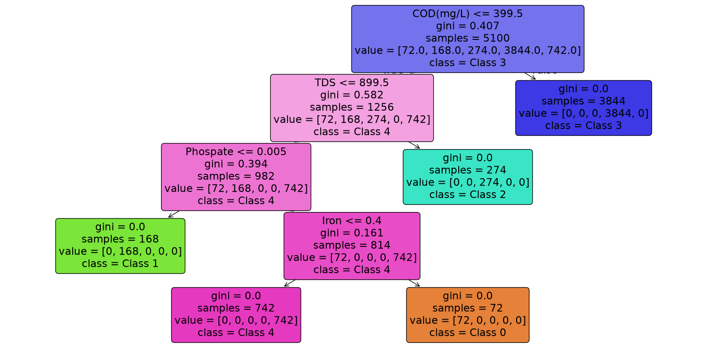

# AquaClass — Water Quality Class Investigation

> Everything can be represented in mathematics.

An exploratory investigation of the `AquaClass: Explainable Water Quality Classification`
dataset from Kaggle.

## 🔎 Why this project?

I initially picked this dataset as a quick revision exercise for multiclass
classification.

The dataset contained a target variable `Class` with five labels:

0, 1, 2, 3, 4

But there was an interesting question:

**What do these class labels actually represent?**

Instead of immediately training a classifier, I decided to investigate the
structure behind the labels first.

## 🧪 EDA Approach

The investigation included:

- Class distribution analysis
- Feature distributions
- K-Means clustering
- Class-wise mean and standard deviation
- Coefficient of variation
- Kruskal-Wallis test
- Dunn's post-hoc test
- Multiple-comparison correction
- Cliff's Delta effect size
- Pairwise feature analysis
- Decision-tree based pattern discovery
- Manual reconstruction of class rules

## 🧠 Class Signatures

The investigation suggested the following descriptive profiles:

| Class | Descriptive Profile |
|------:|---------------------|
| 0 | Ferric Profile |
| 1 | Phosphate-Depleted Profile |
| 2 | Dissolved-Solids Profile |
| 3 | Oxygen-Demand Profile |
| 4 | Neutral Baseline Profile |

## 🔬 Discovered Hierarchical Pattern

A decision-tree investigation revealed a hierarchical structure primarily
involving COD, TDS, Phosphate and Iron.

The reconstructed rule was:

COD > 399.5       → Class 3
otherwise
TDS > 899.5       → Class 2
otherwise
Phospate ≤ 0.005  → Class 1
otherwise
Iron > 0.4        → Class 0
otherwise         → Class 4

This manually reconstructed rule reproduced:

Accuracy: 100%
Mismatches: 0

## ⚠️ Current Status

This repository currently contains the **EDA and class-structure investigation**.

The final machine-learning classification model has NOT been implemented yet.

### Next steps

- [ ] Train/validation/test split
- [ ] Establish baseline classifiers
- [ ] Handle class imbalance
- [ ] Compare multiple classification models
- [ ] Evaluate multiclass performance
- [ ] Explain model predictions
- [ ] Explore Explainable AI
- [ ] Investigate LLM-assisted reasoning

# Dataset

The dataset used in this project is:

AquaClass: Explainable Water Quality Classification

Source:
https://www.kaggle.com/datasets/vanshjasuja16/aquaclass-explainable-water-quality-classification

The dataset is not directly stored in this repository.
Please download it from the original Kaggle source.