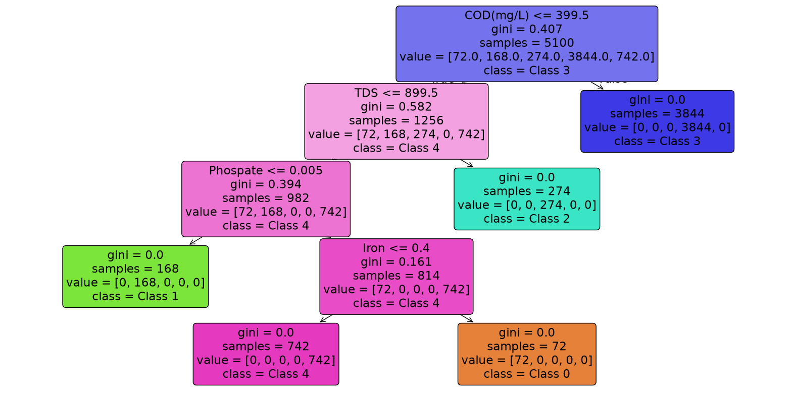

# AquaClass — Explainable Water Quality Classification

> Everything can be represented in mathematics.

An exploratory and explainable multiclass classification investigation of the `AquaClass: Explainable Water Quality Classification` dataset from Kaggle.



## 🔎 Why this project?

I initially picked this dataset as a quick revision exercise for multiclass classification.

The dataset contains a target variable `Class` with five labels:

`0, 1, 2, 3, 4`

But there was an interesting question:

**What do these class labels actually represent?**

Instead of immediately training a classifier, I first investigated the structure behind the labels.

## 🧪 EDA & Statistical Investigation

The investigation included:

- Class distribution analysis
- Feature distributions
- Class-wise statistics
- K-Means clustering
- Kruskal-Wallis test
- Dunn's post-hoc test
- Multiple-comparison correction
- Cliff's Delta effect size
- Pairwise feature analysis
- Decision-tree based pattern discovery
- Manual reconstruction of class rules

## 🧠 Class Signatures

The investigation suggested the following **descriptive profiles**:

| Class | Descriptive Profile |
|------:|---------------------|
| 0 | Ferric Profile |
| 1 | Phosphate-Depleted Profile |
| 2 | Dissolved-Solids Profile |
| 3 | Oxygen-Demand Profile |
| 4 | Neutral Baseline Profile |

These names are descriptive profiles inferred from the dataset, not externally established water-quality categories.

## 🔬 Discovered Hierarchical Pattern

A decision-tree investigation revealed a hierarchical structure primarily involving COD, TDS, Phosphate and Iron.

The reconstructed rule was:

```text
COD > 399.5       → Class 3
otherwise
TDS > 899.5       → Class 2
otherwise
Phospate ≤ 0.005  → Class 1
otherwise
Iron > 0.4        → Class 0
otherwise         → Class 4
```

Applying this manually reconstructed rule to all 5,100 observations produced:

- **Accuracy: 100%**
- **Mismatches: 0**

This strongly suggests that the dataset labels are governed by a deterministic hierarchical threshold structure.

## 🤖 Machine Learning Experiments

After reverse-engineering the class structure, five multiclass classifiers were trained using a stratified **70/15/15 train-validation-test split**.

### Models

- Logistic Regression
- Decision Tree
- Random Forest
- XGBoost
- CatBoost

Because the classes are strongly imbalanced, evaluation focuses on **balanced accuracy and macro-averaged metrics**, rather than accuracy alone.

### Validation & Test Performance

| Model | Validation Accuracy | Test Accuracy | Test Macro F1 |
|---|---:|---:|---:|
| Logistic Regression | 97.12% | 96.73% | ~90.0% |
| Decision Tree | 100.00% | 100.00% | 100.00% |
| Random Forest | 100.00% | 99.87% | ~99.50% |
| XGBoost | 100.00% | 99.87% | ~99.50% |
| CatBoost | 99.61% | 99.87% | ~99.50% |

### What did the models learn?

**Logistic Regression** performs strongly, but does not reproduce the exact threshold hierarchy consistently.

**Tree-based models** align much more closely with the discovered nonlinear and hierarchical structure.

The Decision Tree is especially interesting because, despite being trained only on the training split, it recovered the same core thresholds discovered during EDA:

```text
COD > 399.5
TDS > 899.5
Phospate ≤ 0.005
Iron > 0.4
```

## 🧬 Synthetic Data Experiments

The models were then tested on **controlled synthetic observations outside the original dataset**.

### 1. Controlled Rule Samples

Synthetic points were created so that each one activated a specific branch of the reconstructed rule.

All five models agreed on these straightforward cases.

### 2. Boundary Stress Test

Thresholds were deliberately probed from both sides:

```text
COD       399.4 | 399.5 | 399.6
TDS       899.4 | 899.5 | 899.6
Phospate  0.0049 | 0.0050 | 0.0051
Iron      0.3999 | 0.4000 | 0.4001
```

This exposed differences between models.

The Decision Tree reproduced the discovered rule on all tested boundary points, while Logistic Regression, Random Forest, XGBoost and CatBoost showed small deviations around some exact thresholds.

### 3. Interaction / Precedence Test

Synthetic observations were created where multiple conditions were simultaneously satisfied.

The tree-based models reproduced the hierarchical precedence of the discovered rule across the tested cases.

Logistic Regression showed a disagreement for a combined **low-Phosphate + high-Iron** case, predicting the Iron-associated class instead of the higher-priority Phosphate branch.

### Key finding

The synthetic experiments provide additional evidence that the dataset is not simply characterized by isolated feature differences. Its labels are better described by a **hierarchical threshold-based decision structure**, and tree-based models are naturally aligned with that structure.

## 📊 Model Artifacts

The trained pipelines are saved locally as Joblib artifacts:

```text
models/
├── logistic_regression.joblib
├── decision_tree.joblib
├── random_forest.joblib
├── xgboost.joblib
└── catboost.joblib
```

The serialized model files are currently kept **outside the public repository** to keep the repository lightweight and source-focused.

## 🧠 Explainability — Next Phase

The next phase of the project will focus on Explainable AI:

- Decision Tree visualization
- Feature importance comparison
- SHAP-based explanations
- Local prediction explanations
- Comparison between model explanations and the reverse-engineered dataset rule

The goal is not only to determine **which model performs best**, but also to understand **why it predicts each class**.

## 📁 Project Structure

```text
Aqua-Classification/
│
├── notebooks/
│   ├── 01_EDA_Class_Investigation.ipynb
│   ├── model_training.ipynb
│   └── synthetic_test.ipynb
│
├── model_plot/
├── plots/
├── results/
├── models/                  # local / ignored by Git
│
├── README.md
├── LICENSE
├── requirements.txt
└── .gitignore
```

## 📌 Dataset

**AquaClass: Explainable Water Quality Classification**

Source:  
https://www.kaggle.com/datasets/vanshjasuja16/aquaclass-explainable-water-quality-classification

The original dataset is not stored in this repository.

Please download it directly from the Kaggle source.

## ⚠️ Important Note

The class profiles and hierarchical thresholds described here are **empirical findings from this dataset**.

They should not be interpreted as official drinking-water standards or universal water-quality rules without independent domain validation.

## 🚧 Project Status

**Completed so far:**

- [x] Exploratory data analysis
- [x] Statistical class investigation
- [x] Reverse-engineering of class structure
- [x] Train/validation/test split
- [x] Baseline and tree-based classifiers
- [x] Model comparison
- [x] Synthetic data testing
- [x] Boundary stress testing
- [x] Interaction / precedence testing

**Next:**

- [ ] Feature importance analysis
- [ ] Decision Tree explainability
- [ ] SHAP analysis
- [ ] Local prediction explanations
- [ ] Final XAI conclusions
